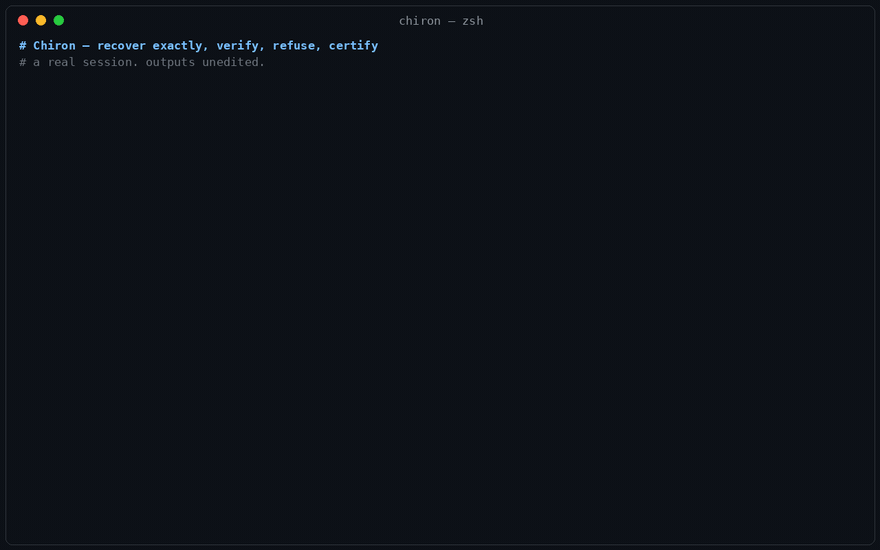

# Chiron

### Exact-or-refuse evidence gates for structured AI outputs.

[](https://github.com/jiannotti5040/chiron/actions/workflows/proof.yml)
[](https://github.com/jiannotti5040/chiron/actions/workflows/live-eval.yml)

Chiron is a **proof-carrying acceptance gate** for the part of an AI output that can be checked exactly. It recovers constrained rules from data, verifies supported claims, refutes false ones, and **refuses to stamp what it cannot prove**. The result is a self-hash-bearing evidence record that says both what passed and what remained uncertified.

Use it when a confidence score is not a release criterion: structured numerical output, a rule recovered from data, or another supported checkable claim where a false pass is more costly than a human review. Chiron is **not** a general truth oracle, a replacement for experts, or a way to certify arbitrary free-form text.

On the current published frozen external eval (2026-07-21): **22 stamped / 22 externally correct / 0 false stamps / 12 honest refusals**, graded live against OEIS ground truth. That is a bounded, reproducible result—not a promise about every possible input. A prior 109-sequence sweep caught 3 false stamps; they were published and fixed at the root, then re-run with 44 verified and zero false. The public CI badges above keep the published proof path testable.

**If a result needs to become a release condition, it needs evidence—not a confidence score.**

<p align="center"></p>

| Try the exact-claim gate | Verify the published evidence | Use it commercially |
|---|---|---|
| **[Check a claim live →](https://jiannotti5040.github.io/chiron/playground/#claim-checker)** | **[Run the public eval →](eval/README.md)** | **[See commercial access →](PRICING.md)** |

> Free to explore and use noncommercially (PolyForm Noncommercial 1.0.0). Commercial use and the full engine are licensed.

---

## Verify it yourself — three depths, no purchase

Each tier says exactly what it proves and what it does not. That restraint is the product.

### 10 seconds — challenge a live exact-claim gate

**[The playground](docs/playground/)** has two distinct demos. The live claim checker sends a non-sensitive test sentence to the licensed-engine endpoint and returns claim-level `VERIFIED`, `REFUTED`, or `REFUSED` results with coverage. The sequence lab lets you paste integers and watch a real Python core verify-or-refuse in the browser — Fibonacci verifies, primes are refused with the reason, and the certificate renders in full.

*Proves:* the contract on a live, limited test input—exact claim-level checks or a stamp only on exact held-out prediction, with refusal otherwise. *Does not prove:* the licensed engine's full reach or the truth of arbitrary prose. The browser sequence core is strictly weaker by design (it refuses Tribonacci, Catalan and factorials, which the engine stamps).

**Live now: [jiannotti5040.github.io/chiron/playground](https://jiannotti5040.github.io/chiron/playground/)** —
or locally, no install: `python3 -m http.server` from the repo root, then `http://localhost:8000/docs/playground/`. Use the public endpoint only for non-sensitive test inputs.

### 2 minutes — grade the engine against ground truth the author does not control

```
git clone https://github.com/jiannotti5040/chiron && cd chiron
python3 eval/grade.py        # live oeis.org; add --cache eval/oeis_snapshot_2026-07-07.json for offline
```

Real session, 2026-07-21, output unedited (18 mid-table rows elided, every one reads "externally CORRECT"):

```
frozen file: engine 0.6.0+source  frozen 2026-07-21T11:26:51+00:00  commit 1652af0acc
tamper check: recomputed rows sha256 MATCHES the recorded one
ground truth: LIVE from oeis.org (b-files, ~1 req/s — the strong mode)

A-number   model class                 graded  verdict
A000032    linear_recurrence_order2      8/8   externally CORRECT
A000045    linear_recurrence_order2      8/8   externally CORRECT
   ...
A006318    holonomic_r2_p1               8/8   externally CORRECT

  stamped 22   externally correct 22   ungraded 0   refused (honest abstentions) 12
  FALSE STAMPS: 0   <- the number this eval exists to check
  RESULT: PASS — zero false verifications on external data
```

*Proves:* the headline property itself — the licensed engine's frozen, self-hash-bearing outputs contain
zero stamps that external data contradicts; and with [`eval/challenge.py`](eval/challenge.py) you
can run the same protocol on sequences **you** choose. *Does not prove:* that everything gets
stamped (12 of 34 are refusals — that is the design). The protocol and its one residual assumption
are stated plainly in [`eval/README.md`](eval/README.md).

And if you want the **real engine on your own input, right now** — a live demo endpoint runs it:

```
python3 eval/remote.py --url https://chiron-engine.onrender.com collapse "1 1 2 3 5 8 13 21 34 55 89 144"   # VERIFIED
python3 eval/remote.py --url https://chiron-engine.onrender.com collapse "2 3 5 7 11 13 17 19 23 29 31 37"   # refuses
```

The licensed engine, served over HTTP — certificate out, source never serialized, rate-limited,
refuses over budget (18/18 endpoint gates). It's a free-tier demo instance (~30 s cold start after
idle); `remote.py` works against any deployment.

### 30 minutes — run every public battery and read the reconciled map

```
./demo.sh          # prototype 26 gates + demo core 17 gates + the frozen-output grade
./demo.sh --live   # the same, plus the live oeis.org grade
```

Then read **[`docs/BATTERIES.md`](docs/BATTERIES.md)** — every gate count in the project on one
page, tiered by what you can verify before paying — and **[`docs/GATES.md`](docs/GATES.md)** for
how to read the numbers honestly.

*Proves:* every public claim in this README, reproduced on your machine, and exactly which claims
are only provable post-license (the vault tiers). *Does not prove:* the vault batteries themselves —
those run with the licensed engine (`bin/chiron test`), and this repo says so rather than asserting
them on trust.

---

## The licensed engine, in 30 seconds

Chiron is handed six numbers and asked for the rule. It finds one, then **checks itself against held-out terms it was not given**:

```
$ chiron collapse 2 4 8 16 32 64
```
```json
{
  "model_class": "geometric",
  "verified": true,
  "exact": true,
  "explanation": "VERIFIED generator 'geometric'. Recovered in EXACT arithmetic
   from the first 4 terms, this rule reproduces every term and predicts all 2
   held-out terms exactly (==, not a tolerance). Compresses 69 bits to 14."
}
```

Now the part a proof gate needs. Hand it a sequence it *can* fit but *cannot* prove:

```
$ chiron collapse 2 3 5 7 11 13 17
```
```json
{
  "model_class": "linear_recurrence_order3",
  "verified": false,
  "explanation": "Recovered a model that reproduces the given terms exactly,
   but its held-out prediction did not confirm (0/2). Status: recovered_unstamped.
   Treat as a candidate, not verified."
}
```

It found a formula that fits every number you gave it — and **still refused to certify it**, because it failed on the numbers you didn't. That refusal is the product. A system that only tells you what it can prove is a system you can build on.

Every run can emit a certificate carrying a self-hash — machine-readable evidence, a plain-language view, and (required on every certificate) **the exact thing that would prove it wrong**:

```json
{
  "system": "CHIRON", "verified": true,
  "human_view": {
    "what_was_discovered": "exact collapse recovers and verifies generators on
     held-out terms, refuses the incompressible, and escalates unsafe actions.",
    "what_would_falsify": "Any core gate failing — a false-verify, a missed
     escalation, or exec-of-string in the core path — would break the claim."
  },
  "self_hash": "fa07ee792bbe970d"
}
```

Real outputs, reproducible today, are in **[`examples/`](examples/)**. A runnable taste is in **[`prototype/`](prototype/)** — clone it and watch it verify and refuse for yourself.

---

## The problem Chiron solves

Organizations are deploying AI into workflows where a wrong structured output can trigger a costly downstream action—and often have no durable record of **what was checked, what passed, and what was left unknown.**

Today, many teams use a mix of confidence scores, LLM judges, tests, and human review. Those are useful tools, but a score or a plausible explanation is not the same thing as an independently checkable release condition.

Chiron is the exact-check layer between a supported machine claim and the decision to accept it. It **checks, refuses, and records the boundary**. Its published external result is deliberately narrow: zero false stamps in the stated frozen evaluation, not a claim that every output will be verifiable.

---

## Who it's for

The same engine answers a different pain for each buyer. They compose — a team can use all four at once.

**Structured-output and quantitative developers — “Recover the rule, or get an honest refusal.”**
You need to distinguish an exact relationship from a convincing fit. Chiron makes held-out evidence and refusal part of the contract, rather than leaving an extrapolation to a caller’s judgment.

**AI product and evaluation engineers — “A confidence score is not a release criterion.”**
You need a narrow, reproducible gate for supported claims inside a larger eval stack. Chiron gives you a deterministic `VERIFIED` / `REFUTED` / `REFUSED` result and a record of exactly what it covered.

**Risk and compliance teams — “Show the check, not just the conclusion.”**
You need evidence artifacts that your own reviewers can inspect: what was checked, the verdict, and the stated limits. Chiron can support that control; it does not replace legal, regulatory, or domain review.

**Researchers and labs — “Candidate discovery is not certification.”**
You need a deterministic framework for exact arithmetic, held-out validation, and reproducible failure cases—not an obligation to publish the best-looking equation.

---

## What makes it different: an evidence record, not a score

Most AI-evaluation tools are valuable for broad monitoring, ranking, and experimentation. Chiron is meant for the narrower moment where a supported result must either carry exact evidence or stop:

- A sequence rule is tested on held-out terms that the fit did not see.
- A supported claim is reported at claim level, while the non-checkable remainder stays visibly uncertified.
- The full engine records the method, verdict, and stated falsifier so a reviewer can replay what the system relied on.

That makes Chiron a useful **last-mile exact gate** beside an existing tracing, monitoring, or LLM-evaluation stack—not a replacement for every part of one.

---

## The model: public proof, commercial engine

Chiron is source-available for noncommercial use and commercially licensed for organizational deployment.

- **This public repository** is the trust layer: the thesis, real examples, a runnable prototype, the architecture, the governance philosophy, and the honest gate results. It answers *why this exists* and lets you verify the claims before you pay.
- **The licensed engine** (`chiron-vault`) is the full system: 72+ folded modules, the certification brain, the composer, the dashboard — delivered as **one self-contained deterministic file** that runs offline with nothing to install.
- **License holders can read, run, modify, and extend** the full engine, and contribute improvements back. Changes to the certified core are owner-approved so the `verified` stamp retains a controlled meaning.

Buying a license gives your organization commercial-use rights, the full offline engine, and a controlled path to build on it.

See **[Pricing](PRICING.md)** for the individual, team, business, and enterprise tiers.

---

## Proof, honestly

Everything above is backed by gates you can run, not adjectives. On the current build (2026-07-16, Python 3.14), the full battery is green:

| Gate | Result |
|---|---|
| Core engine smoke, as **one standalone file** | **5/5** (semic 56/56, chiron core incl. JDICert 280/280, density-emotion 8/8, semic-energy 8/8, epistemic 13/13) |
| Full folded sweep, in-repo | **49/49** modules green through the fold (2026-07-21 build; 48/48 on 2026-07-16 — the sweep grows with the spine) |
| Invariant-operation stress probes | **23/23** |
| Pipeline composer (chain / team / swarm) | **7/7** — no false verification in the published battery |
| Documented-command smoke (every command in the manual runs as written) | **9/9** |
| The TWIN PROOF (two different poems, one recovered generator) | 279,608,910,057,308,160 verses each, identical fingerprint |

**Verify the headline property before paying: [`eval/`](eval/)** — the engine's frozen predictions on 34 public OEIS sequences (12 terms shown, 8 held-out terms per stamp), graded live against oeis.org by a stdlib script, tamper-evident, **22 stamped / 22 externally correct / 0 false stamps / 12 honest refusals** on the 2026-07-21 freeze. `eval/challenge.py` lets you run the same protocol on sequences *you* choose. No engine code ships; outputs are what zero-false is a property of.

**How it compares to symbolic regression: [`docs/SYMREG.md`](docs/SYMREG.md)** — Primus 18 exact / 0 wrong / 11 refused vs PySR's 5 exact / 24 wrong on the same published live-OEIS protocol; both the dated original runs and a 2026-07-21 reproduction have identical counts. The distinction is not that a user cannot wrap another tool with an abstention rule; it is that held-out exact verification and native refusal are part of Chiron’s contract.

**Every gate count in this project, reconciled on one page: [`docs/BATTERIES.md`](docs/BATTERIES.md)** — each battery, what it covers, where it runs (public prototype / vault / single file), and which tier you can verify before paying. If two numbers ever disagree, that page wins.

Methodology: **[`docs/GATES.md`](docs/GATES.md)**. Architecture: **[`docs/ARCHITECTURE.md`](docs/ARCHITECTURE.md)**. The governance stance: **[`docs/GOVERNANCE.md`](docs/GOVERNANCE.md)**. Why it refuses: **[`docs/PHILOSOPHY.md`](docs/PHILOSOPHY.md)**.

And one exhibit that is neither code nor spec: **[`VerifiedInk/`](VerifiedInk/)** — an essay on ink as verdict. It is in this repo on purpose: the aesthetic case for the same thesis the gates make mechanically — that a mark you cannot take back should never be made casually. Read it as the philosophy of the stamp; the code is the enforcement of it.

---

## Start

1. **Open** the [playground](docs/playground/) — paste a sequence, watch it verify or refuse, in your browser.
2. **Run** `./demo.sh` — every public battery plus the frozen-output grade, one command; then [`eval/grade.py`](eval/grade.py) live for the strong mode.
3. **License** the full engine when you have a decision you need to be able to prove: **[Pricing](PRICING.md)**.

> Required Notice: Copyright © 2026 Jacob Iannotti (THRUPUT). Commercial rights reserved.
> Public materials licensed under PolyForm Noncommercial 1.0.0 — see [LICENSE.md](LICENSE.md).
> Questions: jiannotti1@gmail.com
