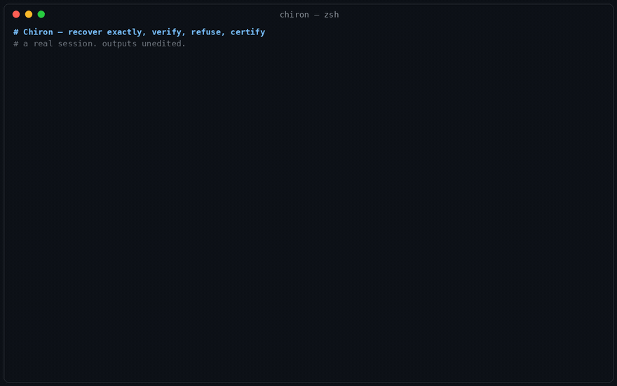

# Chiron

### Every other AI tool competes to be right more often. This one competes to never be wrong.

[](https://github.com/jiannotti5040/chiron/actions/workflows/proof.yml)
[](https://github.com/jiannotti5040/chiron/actions/workflows/live-eval.yml)

The way it does that is by shutting up a lot.

Hand it a sequence and ask for the rule:

```
$ primus collapse "1 1 2 3 5 8 13 21 34 55 89 144"

VERIFIED generator 'linear_recurrence_order2' {'coeffs': [1.0, 1.0], 'seeds': [1.0, 1.0]}.
Recovered from the first 9 terms, this rule then EXACTLY predicts all 3 held-out terms
— 90 bits of data it had never seen, reproduced from a 4-parameter rule. That is proof
it captured the law, not an artifact of fitting.
```

It never graded its own homework. It saw nine terms, three were withheld, and it had to reproduce
all three *exactly* — right integer, every time — before it was allowed to say anything.

Now ask for the rule behind the prime numbers:

```
$ primus collapse "2 3 5 7 11 13 17 19 23 29 31 37"

Best model in class: 'power_law' — Does Not Meaningfully Compress the surface
(355->342 bits, ratio 1.04). Held-out prediction: 0/3 — treat as a candidate,
not yet verified.
```

It found something. It just refused to call it true. **That refusal is the product.** Any model on
earth will hand you a formula for the primes if you ask nicely enough — confidently, instantly, and
wrongly. This one shows you its best guess and then tells you it failed the only test that counted.

### Why you'd care

Because "the model was 94% confident" is not something you can put in a change request, a filing,
or an incident review. Somewhere in your stack there is a number that came out of a language model
and got treated as a fact. Chiron is the thing that stands between that number and the decision —
it verifies what it can prove exactly, refutes what is false, and **marks the rest as unchecked
instead of quietly passing it through**.

On realistic operational text it certifies about **9%** of the sentence. That is not the
disappointing part. That is the deliverable: the 9% is machine-provable and the other 91% is
yours, and now you know which is which *before* you sign your name to it. Every tool that reports
a single confidence score over the whole paragraph has hidden that line from you.

### The same idea, at two scales

The sequence checker above is the small version. It answers *can this claim be proved?* The
`JDICert/` engine in this repository asks the identical question about an entire decision, and
answers it in an 18-section record:

|  | one claim — [`Primus/`](Primus/) | one decision — [`JDICert/`](JDICert/) |
|---|---|---|
| provable now | `VERIFIED` | **K** — known facts, cited |
| demonstrably false | `REFUTED` | — |
| beyond the method | `REFUSED` | **U** unknown · **Ω** unknowable |
| how much was reachable | coverage | Truth Horizon **Θ** |

Below the horizon, the engine is required to escalate rather than proceed. Unknowns get an
explicit due-diligence trail — measured, reframed, modelled, or escalated — so the record shows
what was done about them instead of implying they were never there.

The certificate that falls out is not a log. It carries a regulatory matrix citing the EU AI Act,
GDPR, NIST AI RMF, ISO/IEC 42001 and the Federal Rules; a Merkle ledger; PAC confidence intervals;
an adversarial probe; and a **Daubert / FRE 702 / FRCP 26 admissibility analysis** that names, prong
by prong, the attacks an opposing party would make and the answers the record supports.

**That is the actual thesis of this repository.** Exact verification is the trust anchor — the one
section of the record that cannot be argued with — and the record is the product. Nobody defends an
automated decision by producing a benchmark score. They produce evidence, or they lose.

### Has it ever lied?

Yes. Three times, all published, all in the commit log with the repair beside them.

The worst one is worth reading: the very first external run — against live OEIS data, after ~5,070
internal test cases had passed clean — caught it stamping a wrong number. The cause was that the
held-out check had been comparing with a `1e-6` tolerance while the documentation promised exact
equality. At the magnitudes involved, that forgave an error of about ten thousand.

It got caught because the check runs against data the author doesn't control. Exact arithmetic is
structural now, and every external run since reports **zero false verifications** — the one number
in this project that is not allowed to move.

Same discipline at scale: pointed at **3,195 open conjectures** from DeepMind's `formal-conjectures`
(Erdős, Hilbert, Millennium), it discharged 302 and **refused 90.5%**. That is the correct answer.
Open problems are open precisely because they aren't finitely checkable — a tool reporting a high
success rate there would be broken, not brilliant.

```
pip install primus-intelligence
```

**If a result has to become a release condition, it needs evidence — not a confidence score.**

<p align="center"></p>

| Try the exact-claim gate | Verify the published evidence | Run the whole engine |
|---|---|---|
| **[Open the playground →](https://jiannotti5040.github.io/chiron/playground/)** | **[Run the public eval →](eval/README.md)** | **[`pip install primus-intelligence` →](Primus/README.md)** |

> **Apache-2.0. Nothing is held back.** There is no paid tier, no private repository, and no
> feature behind a licence key — the full engine, the folded monolith, the gate battery, and
> every research capsule are in this repository. Use it commercially, modify it, ship it in a
> product. Attribution is the only condition. Prose and books are CC BY 4.0 — see
> [LICENSES.md](LICENSES.md).

---

## The bottleneck is no longer discovery. It is verification.

In July 2026 an AI system produced a counterexample to the **Jacobian conjecture**,
open since 1939. Days later another produced one to the **Dinitz–Garg–Goemans
conjecture**, open since the 1990s. Both were announced ahead of peer review.
Follow-on families and fresh counterexamples in adjacent problems arrived within
the week.

Machines can now generate candidate mathematics faster than people can check it.
Proof assistants are one answer, but formalization is expensive. Computer algebra
is another, but it does not tell you what it failed to establish. The open
question is narrower and more practical:

> **When a machine announces a result, which parts of it can be checked exactly,
> right now — and which parts must a human still own?**

That question is what Chiron answers, and the refusals are as much of the answer
as the checks.

### Two announced counterexamples, ingested and checked

| | What was checked | Result |
|---|---|---|
| **Jacobian** (Alpöge / Claude Fable 5) | `det J ≡ −2` as an exact polynomial identity over ℚ; a two-point rational collision denying injectivity | **12/12 gates** |
| **Dinitz–Garg–Goemans** (Rybin / GPT-5.6 Pro) | fractional flow feasible at cost **58**; all 2³ unsplittable routings enumerated; cheapest congestion-admissible one costs **60** | **15/15 gates** |
| **The whole DGG family** | every admissible instance with `b ≤ 25` — **456** of them — refutes, exhaustively, in exact integers | **456/456** |

Exact rational and integer arithmetic. No solver, no floats, no network.

The claim is deliberately narrow, and the wording is the point: Chiron
**independently certified the finite computational claims constituting each
published counterexample, under the encoded formulation.** It did not certify
either conjecture false. Provenance, minimality, the Jacobian `n = 2` case, the
DGG theorem itself, and peer review are all **outside certificate scope** and are
recorded as refusals.

The Jacobian map now has an independent Isabelle/HOL formalization, so checking it
adds no missing mathematical fact. What it demonstrates is a systems property: a
general-purpose verifier, **not written for either conjecture**, ingested both and
recovered their decisive finite obligations.

**[Read what was verified — and what was refused →](docs/AI_CLAIMS.md)**

### The same contract, run across 3,195 open conjectures

Two hand-picked results prove little on their own. So the same engine was pointed
at [`google-deepmind/formal-conjectures`](https://github.com/google-deepmind/formal-conjectures)
— 850 Lean files spanning Erdős problems, Hilbert problems, Millennium problems and
OEIS conjectures — and asked the only question it is entitled to ask of each:
*is there a finite exact obligation here that I can discharge?*

| Verdict | Theorems | |
|---|---:|---|
| `REFUSED-NEEDS-LEAN` | 1,545 | 48.4% |
| `REFUSED-INFINITARY` | 922 | 28.9% |
| `REFUSED-NO-ANSWER` | 426 | 13.3% |
| **`FINITE-CHECKABLE`** | **302** | **9.5%** |

**Chiron refuses 90.5% of this corpus, and that is the correct answer.** Open
conjectures are open precisely because they are not finitely checkable. A tool
reporting a high success rate here would be broken, not capable.

The calibration check is that the classifier never sees the corpus's own labels,
yet independently rediscovers them. Theorems DeepMind tags `test` account for 215
of the 302 finite-checkable obligations — 71% of everything Chiron can discharge
comes from the 18% of the corpus that is sanity checks. Meanwhile `research open`
returns **432 infinitary and 418 unanswered against just 18 finite**.

Of the OEIS-referencing subset, **35 concrete obligations were discharged against
live oeis.org data with zero contradictions**, and 21 statements were refused.

### What refusal buys you: the finite part of an open problem

Refusing the general statement is not the end of the work. An existential falls
to one witness and a universal to one counterexample, so many open conjectures
have a finite core that can be searched exhaustively — which is exactly how DGG
fell. Run against three open conjectures from the corpus, in exact integer
arithmetic:

| Open conjecture | Exhaustive search | Verdict | Prior art |
|---|---|---|---|
| **A063880** — every member of `σ(n) = 2·usigma(n)` is `≡ 108 (mod 216)` | all **28,141** members below 10,000,000 | holds | no published bound found |
| **A063880** — 108 is the only primitive term | same range | holds; 108 unique | no published bound found |
| **Juggler** — every `n > 0` reaches 1 | all `n ≤ 20,000` | holds; longest run 166 steps | verified far beyond this |
| **Gilbreath** — `dᵏ(0) = 1` for all `k > 0` | `k = 1 … 29,999` over 30,000 primes | holds | **Odlyzko: 10¹³** |

**These bounds are not advances.** Gilbreath is verified to 10¹³ and the Juggler
map far past 20,000; the searches above re-derive known ground and are shown
because they demonstrate the *contract*, not because they extend it. A bound
printed without its prior art is a number flattering itself, so the column is
mandatory here.

Each result is stamped `VERIFIED-TO-N`, **never as a proof**, and each general
statement remains `REFUSED` — unbounded `n` is not enumerable. Reporting a
bounded check as if it settled a conjecture is the precise failure this project
exists to prevent, so the distinction is enforced in the verdict itself rather
than left to the reader. Where the Juggler search hits its step cap it reports
`REFUSED`, never `REFUTED`: failing to terminate within a bound is not evidence
of divergence.

Two details that show why the arithmetic is exact rather than floating-point:
the enumerator is validated against all 40 of OEIS's published A063880 terms
before it is trusted, and the Juggler trajectory from `n = 15845` peaks at a
**~23,889-digit integer** — a float implementation goes wrong long before that.

Reproduce the corpus numbers yourself — no licence, no engine, no account:

```bash
git clone --depth 1 https://github.com/google-deepmind/formal-conjectures
python3 eval/conjecture_triage.py triage formal-conjectures
```

---

## Use it in your agent — free, offline, 30 seconds

Gate your own agent's output with the same engine. No key, no account, no repo access:

```bash
pip install primus-intelligence
claude mcp add primus -- primus-mcp
```

Three MCP tools appear: **`certify`** (mark every checkable claim `VERIFIED` / `REFUTED` /
`REFUSED`, and report the coverage boundary), **`collapse`** (recover an exact rule, proven on
held-out terms, or refuse), **`conjecture`** (guess-and-prove behind an exact gate). Runs locally
and offline, under Apache-2.0. Setup for Claude Desktop, Cursor and other clients:
**[`docs/MCP.md`](docs/MCP.md)**.

A `certify` pass means nothing checkable was refuted — *not* that the text is true. Coverage tells
you how much the gate could see. The tool is built so you cannot lose that distinction.

---

## Verify it yourself — three depths, no purchase

Each tier says exactly what it proves and what it does not. That restraint is the product.

### 10 seconds — challenge a live exact-claim gate

**[The playground](docs/playground/)** has two distinct demos. The live claim checker sends a non-sensitive test sentence to the full-engine endpoint and returns claim-level `VERIFIED`, `REFUTED`, or `REFUSED` results with coverage. The sequence lab lets you paste integers and watch a real Python core verify-or-refuse in the browser — Fibonacci verifies, primes are refused with the reason, and the certificate renders in full.

*Proves:* the contract on a live, limited test input—exact claim-level checks or a stamp only on exact held-out prediction, with refusal otherwise. *Does not prove:* the full engine's reach or the truth of arbitrary prose. The browser sequence core is strictly weaker by design (it refuses Tribonacci, Catalan and factorials, which the full engine stamps).

**Live now: [jiannotti5040.github.io/chiron/playground](https://jiannotti5040.github.io/chiron/playground/)** —
or locally, no install: `python3 -m http.server` from the repo root, then `http://localhost:8000/docs/playground/`. Use the public endpoint only for non-sensitive test inputs.

### 2 minutes — grade the engine against ground truth the author does not control

```
git clone https://github.com/jiannotti5040/chiron && cd chiron
python3 eval/grade.py        # live oeis.org; add --cache eval/oeis_snapshot_2026-07-07.json for offline
```

Real session, 2026-07-21, output unedited (18 mid-table rows elided, every one reads "externally CORRECT"):

```
frozen file: engine 0.6.0+source  frozen 2026-07-21T11:26:51+00:00  commit 1652af0acc
tamper check: recomputed rows sha256 MATCHES the recorded one
ground truth: LIVE from oeis.org (b-files, ~1 req/s — the strong mode)

A-number   model class                 graded  verdict
A000032    linear_recurrence_order2      8/8   externally CORRECT
A000045    linear_recurrence_order2      8/8   externally CORRECT
   ...
A006318    holonomic_r2_p1               8/8   externally CORRECT

  stamped 22   externally correct 22   ungraded 0   refused (honest abstentions) 12
  FALSE STAMPS: 0   <- the number this eval exists to check
  RESULT: PASS — zero false verifications on external data
```

*Proves:* the headline property itself — the engine's frozen, self-hash-bearing outputs contain
zero stamps that external data contradicts; and with [`eval/challenge.py`](eval/challenge.py) you
can run the same protocol on sequences **you** choose. *Does not prove:* that everything gets
stamped (12 of 34 are refusals — that is the design). The protocol and its one residual assumption
are stated plainly in [`eval/README.md`](eval/README.md).

And if you want the **real engine on your own input, right now** — install it and run it:

```
pip install primus-intelligence
primus collapse "1 1 2 3 5 8 13 21 34 55 89 144"   # VERIFIED
primus collapse "2 3 5 7 11 13 17 19 23 29 31 37"   # refuses
```

Prefer it over HTTP? `primus-serve` starts the same engine locally — certificate out,
rate-limited, refuses over budget (33/33 endpoint gates in
[`Primus/test_engine_server.py`](Primus/test_engine_server.py)) — and
[`eval/remote.py`](eval/remote.py) works against any deployment you run. There is no
managed instance to depend on, and no cold start.

### 30 minutes — run every public battery and read the reconciled map

```
./demo.sh          # prototype 26 gates + demo core 17 gates + the frozen-output grade
./demo.sh --live   # the same, plus the live oeis.org grade
```

Then read **[`docs/BATTERIES.md`](docs/BATTERIES.md)** — every gate count in the project on one
page — and **[`docs/GATES.md`](docs/GATES.md)** for how to read the numbers honestly.

*Proves:* every claim in this README, reproduced on your machine. Every battery is in this
repository and runs from this checkout — there is no longer a tier you cannot reach, and
nothing is asserted on trust.

---

## The engine, in 30 seconds

Chiron is handed six numbers and asked for the rule. It finds one, then **checks itself against held-out terms it was not given**:

```
$ chiron collapse 2 4 8 16 32 64
```
```json
{
  "model_class": "geometric",
  "verified": true,
  "exact": true,
  "explanation": "VERIFIED generator 'geometric'. Recovered in EXACT arithmetic
   from the first 4 terms, this rule reproduces every term and predicts all 2
   held-out terms exactly (==, not a tolerance). Compresses 69 bits to 14."
}
```

Now the part a proof gate needs. Hand it a sequence it *can* fit but *cannot* prove:

```
$ chiron collapse 2 3 5 7 11 13 17
```
```json
{
  "model_class": "linear_recurrence_order3",
  "verified": false,
  "explanation": "Recovered a model that reproduces the given terms exactly,
   but its held-out prediction did not confirm (0/2). Status: recovered_unstamped.
   Treat as a candidate, not verified."
}
```

It found a formula that fits every number you gave it — and **still refused to certify it**, because it failed on the numbers you didn't. That refusal is the product. A system that only tells you what it can prove is a system you can build on.

Every run can emit a certificate carrying a self-hash — machine-readable evidence, a plain-language view, and (required on every certificate) **the exact thing that would prove it wrong**:

```json
{
  "system": "CHIRON", "verified": true,
  "human_view": {
    "what_was_discovered": "exact collapse recovers and verifies generators on
     held-out terms, refuses the incompressible, and escalates unsafe actions.",
    "what_would_falsify": "Any core gate failing — a false-verify, a missed
     escalation, or exec-of-string in the core path — would break the claim."
  },
  "self_hash": "fa07ee792bbe970d"
}
```

Real outputs, reproducible today, are in **[`examples/`](examples/)**. A runnable taste is in **[`prototype/`](prototype/)** — clone it and watch it verify and refuse for yourself.

---

## The problem Chiron solves

Organizations are deploying AI into workflows where a wrong structured output can trigger a costly downstream action—and often have no durable record of **what was checked, what passed, and what was left unknown.**

Today, many teams use a mix of confidence scores, LLM judges, tests, and human review. Those are useful tools, but a score or a plausible explanation is not the same thing as an independently checkable release condition.

Chiron is the exact-check layer between a supported machine claim and the decision to accept it. It **checks, refuses, and records the boundary**. Its published external result is deliberately narrow: zero false stamps in the stated frozen evaluation, not a claim that every output will be verifiable.

---

## Who it's for

The same engine answers a different pain for each buyer. They compose — a team can use all four at once.

**Structured-output and quantitative developers — “Recover the rule, or get an honest refusal.”**
You need to distinguish an exact relationship from a convincing fit. Chiron makes held-out evidence and refusal part of the contract, rather than leaving an extrapolation to a caller’s judgment.

**AI product and evaluation engineers — “A confidence score is not a release criterion.”**
You need a narrow, reproducible gate for supported claims inside a larger eval stack. Chiron gives you a deterministic `VERIFIED` / `REFUTED` / `REFUSED` result and a record of exactly what it covered.

**Risk and compliance teams — “Show the check, not just the conclusion.”**
You need evidence artifacts that your own reviewers can inspect: what was checked, the verdict, and the stated limits. Chiron can support that control; it does not replace legal, regulatory, or domain review.

**Researchers and labs — “Candidate discovery is not certification.”**
You need a deterministic framework for exact arithmetic, held-out validation, and reproducible failure cases—not an obligation to publish the best-looking equation.

---

## What makes it different: an evidence record, not a score

Most AI-evaluation tools are valuable for broad monitoring, ranking, and experimentation. Chiron is meant for the narrower moment where a supported result must either carry exact evidence or stop:

- A sequence rule is tested on held-out terms that the fit did not see.
- A supported claim is reported at claim level, while the non-checkable remainder stays visibly uncertified.
- The full engine records the method, verdict, and stated falsifier so a reviewer can replay what the system relied on.

That makes Chiron a useful **last-mile exact gate** beside an existing tracing, monitoring, or LLM-evaluation stack—not a replacement for every part of one.

---

## What's in this repository

Everything. This used to be two repositories — a public trust layer and a private engine behind a
paid licence. They are now one Apache-2.0 project, and the paywall is gone for good.

- **[`Primus/`](Primus/)** — the seed engine and the `primus-intelligence` package: exact invariant
  recovery, held-out verification, the `certify` claim gate, an MCP server, and an HTTP server.
- **[`Chiron/`](Chiron/)** — the flagship: the certification layer, the composer, the dashboard, and
  the module set the monolith folds.
- **[`Chiron Monolith/`](Chiron%20Monolith/)** — the whole flagship folded into one self-contained
  deterministic file that runs offline with nothing to install.
- **[`studies/`](studies/)** — the research: OEIS extensions, conjecture sweeps, refutations,
  retractions, and replay capsules with pinned evidence.
- **[`docs/`](docs/)** — the published site and the reconciled gate map. **[`notes/`](notes/)** — the
  working records, kept unedited including the failures.
- The prose works (the books, the Paper) are **CC BY 4.0**; everything else is **Apache-2.0**.
  See [LICENSES.md](LICENSES.md).

Contributions to the certified core are reviewed against the full gate battery before merge — not to
gatekeep, but because a `verified` stamp that has never lied is the only thing this project actually
sells, and it is now free. See [CONTRIBUTING.md](CONTRIBUTING.md).

---

## The full ladder

Four rungs, each answering what the one below it structurally cannot. They were built as separate
projects; they are one system.

| Ask | Answers | Where |
|---|---|---|
| Can this claim be proved exactly? | `VERIFIED` / `REFUTED` / `REFUSED` | [`Primus/`](Primus/), [`Chiron/`](Chiron/) |
| Does it match the system of record? | ontology grounding — closes the coverage gap below | the readiness gate (external) |
| Would the record survive scrutiny? | Daubert · FRE 702 · FRCP 26 analysis | [`JDICert/`](JDICert/) — **12,907 lines, 280/280 gates** |
| What standard of care applies at all? | LexGuard, the persuasive-machines standard | [`Governance/`](Governance/) |

The gap that makes the ladder necessary is measured, not assumed. Every `certify` claim kind is
**self-contained** — provable from the claim text alone — so on realistic operational text coverage
is about **0.09**. It verifies `4200 / 1400 = 3` and leaves *"Unit Bravo has 3 days of fuel"* — the
sentence a human acts on — uncertified. Rung 2 exists because rung 1 cannot reach that sentence, and
rung 3 exists because being right is not the same as being able to prove you were right afterwards.

[`JDICert/`](JDICert/) is the least-known piece and possibly the most valuable: given a certificate,
`analyze_legal_admissibility()` returns whether it would survive a Daubert challenge, prong by prong,
with the attack an opposing party would make and the answer the record supports. It grades its own
engine *challenged* on two factors rather than claiming a clean sheet.

The load-bearing idea across all four: **a system that scores every claim has to defend its scoring
function. A system that refuses has to defend only the boundary — and the boundary is arithmetic.**
Refusal is not this project's limitation. It is the reason any of it holds up.

---

## Proof, honestly

Everything above is backed by gates you can run, not adjectives. On the current build (2026-07-16, Python 3.14), the full battery is green:

| Gate | Result |
|---|---|
| Core engine smoke, as **one standalone file** | **5/5** (semic 56/56, chiron core incl. JDICert 280/280, density-emotion 8/8, semic-energy 8/8, epistemic 13/13) |
| Full folded sweep, in-repo | **49/49** modules green through the fold (2026-07-21 build; 48/48 on 2026-07-16 — the sweep grows with the spine) |
| Invariant-operation stress probes | **23/23** |
| Pipeline composer (chain / team / swarm) | **7/7** — no false verification in the published battery |
| Documented-command smoke (every command in the manual runs as written) | **9/9** |
| The TWIN PROOF (two different poems, one recovered generator) | 279,608,910,057,308,160 verses each, identical fingerprint |

**Verify the headline property yourself: [`eval/`](eval/)** — the engine's frozen predictions on 34 public OEIS sequences (12 terms shown, 8 held-out terms per stamp), graded live against oeis.org by a stdlib script, tamper-evident, **22 stamped / 22 externally correct / 0 false stamps / 12 honest refusals** on the 2026-07-21 freeze. `eval/challenge.py` lets you run the same protocol on sequences *you* choose. No engine code ships; outputs are what zero-false is a property of.

**How it compares to symbolic regression: [`docs/SYMREG.md`](docs/SYMREG.md)** — under the head-to-head harness (stricter than the `oeis_live` battery: exact 4/4 continuation only, so its Primus column reads 18 where BATTERIES records 20 verified) Primus scores 18 exact / 0 wrong / 11 refused against PySR's 5 exact / 24 wrong; both the dated original runs and a 2026-07-21 reproduction have identical counts. The distinction is not that a user cannot wrap another tool with an abstention rule; it is that held-out exact verification and native refusal are part of Chiron’s contract.

**Every gate count in this project, reconciled on one page: [`docs/BATTERIES.md`](docs/BATTERIES.md)** — each battery, what it covers, and where it runs (seed engine / flagship / single file). If two numbers ever disagree, that page wins.

Methodology: **[`docs/GATES.md`](docs/GATES.md)**. Architecture: **[`docs/ARCHITECTURE.md`](docs/ARCHITECTURE.md)**. The governance stance: **[`docs/GOVERNANCE.md`](docs/GOVERNANCE.md)**. Why it refuses: **[`docs/PHILOSOPHY.md`](docs/PHILOSOPHY.md)**.

And one exhibit that is neither code nor spec: **[`VerifiedInk/`](VerifiedInk/)** — an essay on ink as verdict. It is in this repo on purpose: the aesthetic case for the same thesis the gates make mechanically — that a mark you cannot take back should never be made casually. Its **Evidence Trace** now appears in the sequence lab as a certificate-backed view of the shown/held-out seam; the visual explains the proof boundary, while the certificate remains authoritative. Read Verified Ink as the philosophy of the stamp; the code is the enforcement of it.

---

## Start

1. **Open** the [playground](docs/playground/) — paste a sequence, watch it verify or refuse, in your browser.
2. **Run** `./demo.sh` — every public battery plus the frozen-output grade, one command; then [`eval/grade.py`](eval/grade.py) live for the strong mode.
3. **Install** the full engine when you have a decision you need to be able to prove: `pip install primus-intelligence`.

> Copyright © 2026 Jacob Iannotti. Code under Apache-2.0, prose under CC BY 4.0 — see [LICENSES.md](LICENSES.md).
> Public materials licensed under Apache-2.0 — see [LICENSE.md](LICENSE.md).
> Questions: jiannotti1@gmail.com
