<!-- The 90-second front door. Plain English first; technical depth is in README.md. -->

# Start here

**In one sentence:** a portable, offline engine that reads an ambiguous input, works out the exact rule underneath it, *proves* that rule by predicting data it was never shown — and flatly **refuses** when it can't. Its one hard promise: it never says "verified" about something it hasn't exactly proven.

**The problem it solves.** Modern AI answers everything in the same confident tone, whether it *knows* or is *guessing*. Anywhere a wrong answer is expensive — a decision system, a compliance check, an agent taking real actions — you need to separate what an answer has **proven** from what it merely **asserts**. This repo is that separator, built as a tool you can install and call.

## See it in 20 seconds

```bash
pip install ./Primus

primus collapse "1 1 2 3 5 8 13 21"
#  → recovers the Fibonacci rule and predicts the next terms, exactly

primus collapse "2 3 5 7 11 13 17"
#  → REFUSES: primes have no such rule, so it will not guess
```

The refusal is the point. There's also a browser demo that runs the *real* engine, no install: **[playground.html](playground.html)**.

## What this demonstrates (the hiring-manager version)

I take an ambiguous real-world input and ship a system people can **trust** — correct or silent, never confidently wrong. Concretely, this repo is evidence that I can:

- **Ship a system with a hard correctness contract and prove it holds** — 155+ automated gates in CI, and **zero false verifications** in the current battery across ~5,000 internal and 35 live, externally-sourced cases.
- **Validate against the real world and fix failures in the open.** The zero-false promise has been *falsified three times* by external data and repaired at the root each time — the most recent, a live false stamp on the OEIS companion-Pell sequence, was found, root-caused, and fixed in one pass ([the story](Primus/EXTERNAL_VALIDATION.md)). A caught-and-repaired defect is worth more than an unblemished claim.
- **Design and hold a large system in my head** — 60+ modules organized around a single contract, not a pile of scripts.
- **Say exactly how sure I am** — every claim is tagged proven / measured / prototype / theory. No overclaiming; the honesty is enforced by the engine itself.

Those are the load-bearing skills for shipping trustworthy systems into messy, high-stakes environments.

## How it fits together — one glance



Symbolic names are kept (they're the project's language); the plain-English equivalent is in italics.

| Part | *Plain English* | What it does |
|---|---|---|
| **Well** | *I/O membrane* | the only door in or out — all input enters and all output leaves here |
| **JDICert** | *the trust gate* | decides VERIFIED / REFUTED / REFUSED; nothing reaches a human unproven |
| **Primus** | *the engine* | recovers the exact rule under a surface and proves it on held-out data |
| **Congress** | *the knowledge store* | Vault (content-addressed), Crystal (similarity index), Bank (provenance ledger), Library (reusable parts) |
| **President** | *bounded executive* | deliberates over public archives; escalates anything irreversible to a human |
| **Infectatrum / Infecticon** | *ambiguity meter / vocabulary mint* | measure how ambiguous an input is; coin new terms when a rule needs them |

## How sure is each claim? (the evidence ladder)

Everything in this repo carries one of these labels, so nothing is oversold:

- **A · Proven** — checked by automated tests or by exact prediction of unseen data.
- **B · Measured** — benchmarked numbers you can reproduce with one command.
- **C · Observed** — seen to work, not yet formally gated.
- **D · Hypothesis / E · Future** — theory and direction, labeled as such.

The **engine and the benchmarks are A/B** (reproducible, gated). The **governance, "organism," and physics layers are C/D** — real, interesting, and honestly marked as prototype/theory. That labeling *is* the discipline.

## If you have 10 more minutes

1. `pip install ./Primus && primus certify "your text with a claim like 2+2=5"` — watch it verify, refute, and refuse, claim by claim.
2. Read **[Primus/EXTERNAL_VALIDATION.md](Primus/EXTERNAL_VALIDATION.md)** — the falsify-and-repair story is the clearest window into how I work.
3. Then the full technical depth is in **[README.md](README.md)**.
