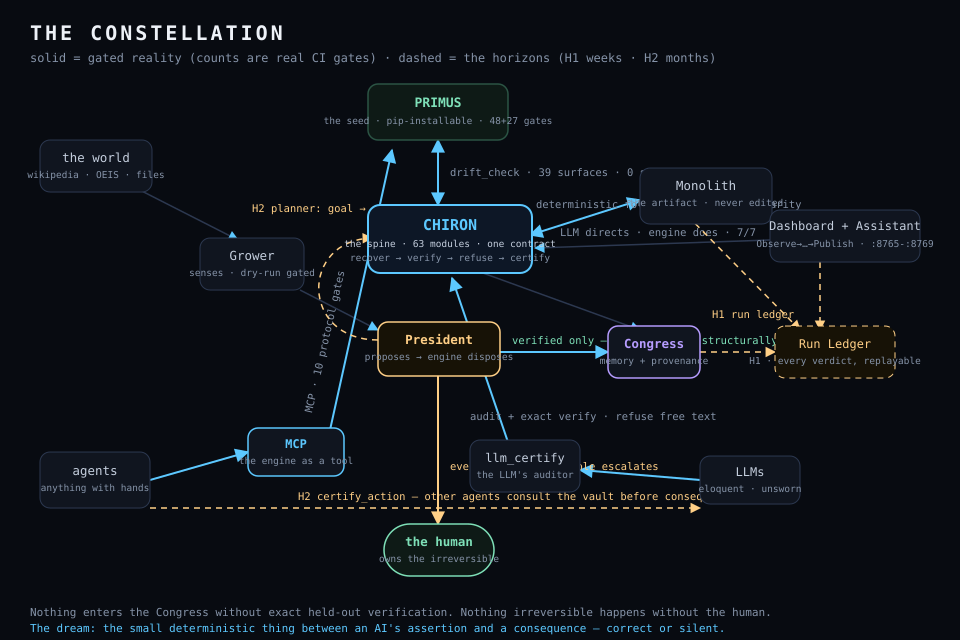

# The Long Horizon — what the vault is becoming

*Written 2026-07-09, against commit `ac99a63`. Like everything here, this document is
falsifiable — §6 says exactly how. Every claim carries its epistemic status:*
**[proven]** *a gate enforces it in CI ·* **[measured]** *demonstrated, numbers recorded ·*
**[prototype]** *works, not yet hardened ·* **[theory]** *designed, unbuilt ·* **[dream]** *the star we steer by.*

---

## 0 · The thesis

Modern AI answers everything in the same confident voice, whether it knows or is guessing.
The vault's answer is a machine that is **correct or silent** — and the long-horizon bet is
that this property stops being a portfolio piece and becomes **infrastructure**: the moment
of proof that sits between an AI's assertion and a consequence in the world.

Agents are being handed hands — file systems, payments, deployments, lab equipment. Every
one of those hands needs a conscience that cannot be sweet-talked, because it does not run
on talk: it runs on exact arithmetic and refuses everything else. The vault already *is*
that conscience in miniature **[measured]** — 155+ CI gates, zero false verifications across
~5,000 internal and 35+ live external cases, three public falsify-and-repair stories. The
horizon is scale: from *a conscience* to *the conscience other systems call*. The first step of that scaling is already beating: the **heartbeat** (`heartbeat.py`) moves the vault on its own pulse — reading its own organs *inward* into a self-grown memory, reaching *outward* at the world, and *self-verifying* every beat — the tempo off the harness with the truth left untouched.

---

## 1 · Where it honestly stands today

*This section is the honest baseline as of 2026-07-09. Since then, parts of Horizon One
have shipped — the **run ledger**, the **heartbeat + vault certificate**, and the dashboard's
**Pulse** stage; see the `(shipped)` tags in §2. The "No"/"theory" statements below are kept
as the record they were written against, so progress can be measured against an honest start.*

The agentic wiring that already exists — each line is real, gated code, not aspiration:

| Loop | Mechanism | Status |
|---|---|---|
| Agents can call the engine | `primus.mcp_server` — collapse/certify over MCP | **[proven]** 10 protocol gates |
| The engine audits LLMs | `llm_certify` — audit honesty, verify checkable claims, refuse free text | **[proven]** selftest gates |
| LLM directs, engine does | `assistant_server` — intent → real deterministic action, never the source of truth | **[proven]** 7/7 offline gates |
| LLM proposes, engine disposes | `president_grow` — proposals enter Congress only through exact held-out verification | **[proven]** hallucination structurally excluded |
| Human owns the irreversible | President escalation + self-edit quarantine (`proposals/`, backup, re-gate) | **[proven]** by construction |
| Shared memory with provenance | the Congress — domains, laws, signed root | **[measured]** |
| Two incarnations, one truth | deterministic fold + `drift_check` (39 surfaces) + 41/41 parity sweep | **[proven]** in CI |
| External reality checks | live-OEIS corpus, post-development probes, falsified-and-repaired ×3 | **[measured]** publicly ledgered |

### Is the dashboard fully realized? — **No.**

It reached *organized*: one cockpit, six workflow stages (Observe → Understand → Reason →
Verify → Remember → Publish), the certificate browser inside Verify, one command to serve
everything. What it has not reached is *flow*:

- Stages don't hand off. An Analyze verdict should land you on its certificate in Verify;
  a grow acceptance should surface in Understand. Today each stage is a room; the workflow
  is still hallways you walk yourself. **[theory]**
- There is no vault-level memory of activity — no "what changed since you last looked,"
  no run history. The Remember stage shows the organism's growth, not *your* operations. **[theory]**
- Growth panels poll; they should stream (the PDF review's "crawler as a service with
  live status" — partially present via grow control, not unified). **[prototype]**

### Are the engines aligned to work strategically, autonomously, agentically together? — **Pairwise yes; orchestrally not yet.**

Every integration above is hub-and-spoke: a human or a single LLM turn picks one engine,
runs it, reads the result. What a strategic organism adds — none of which exists yet, all
of which the architecture was shaped for:

- **A shared goal object.** Nothing today represents "what we are trying to accomplish"
  across engine calls. **[theory]**
- **A planner that composes engines.** The assistant routes one intent to one action;
  nobody chains collapse → semic → certify → publish toward a goal. **[theory]**
- **Memory of what worked.** No run ledger feeds outcomes back into strategy. **[theory]**
- **An inter-engine contract.** Engines talk through imports and files; a common
  invocation record (who, what, verdict, certificate) is the missing spine. **[theory]**

### Are the spine and the fold completely integrated? — **Contractually yes; experientially not yet.**

The contract is strong **[proven]**: the fold is byte-identical embedded source, the build
is deterministic (CI fails if rebuilding changes a byte), `drift_check` forbids unledgered
disagreement, and the full sweep runs the same 41 selftests through the fold that the spine
runs flat. But the *experience* still has two worlds: `chiron dev` vs `chiron run`,
certificates that don't say which incarnation produced them, a dashboard that doesn't show
which one is serving it. Closing that gap is Horizon One's first pillar — and its first
piece ships with this document: **`chiron parity`** runs the spine's gate suite through both
incarnations and asserts the outcomes are identical **[proven]** (wired into `bin/chiron`).

---

## 2 · Horizon One — the organism closes its loops *(weeks)*

**H1.1 — Spine ↔ fold: total integration.** *(shipped: `chiron parity` — the spine's full gate suite run through both incarnations, 138 identical outcomes required; proven to have teeth in [STRESS_TEST.md](STRESS_TEST.md).)*
Parity as a CI gate, not just a CLI verb. The fold's hash embedded in every certificate, so
a verdict names its incarnation. An incarnation badge in the dashboard header. Drift
surfaces extended from Primus sequences to Chiron behaviors (semic verdicts, candor scores,
governance gates) — target ≥100 surfaces. *Falsifier: any behavioral difference between
spine and fold that a user can observe but the battery cannot.*

**H1.2 — The run ledger.** *(shipped: `Chiron/run_ledger.py` — append-only, crash-healing, replay-exact; 9/9 gates. Every console/assistant/CLI/heartbeat invocation is witnessed. The heartbeat above it emits the organism-level **vault certificate** each beat and, per the constitution, never reports a beat green over a failed movement.)*
Every engine invocation appends one record — engine, input hash, verdict, certificate path,
duration, incarnation — to an append-only vault ledger. The Remember stage becomes actual
memory of operations; `chiron doctor` reads health from it; strategy (H2) will learn from it.
*Falsifier: a ledger replay that fails to reproduce any recorded verdict.*

**H1.3 — Workflow that flows.** *(partially shipped: the dashboard's **Pulse** stage renders the live vault certificate + streaming ledger + since-you-last-looked; Run and Analyze deep-link to their certificates in Verify. Still ahead: acceptance→Congress and gate-failure→module-tile links.)*
Deep links between stages: verdict → certificate, acceptance → Congress entry, gate failure →
the module tile that failed. A "since you last looked" diff on the home stage. *Gate: a new
user goes ingest → proof → publish without touching a terminal.*

**H1.4 — Sources as plugins.**
The ingestion pipeline as a contract — `fetch → normalize → deduplicate → attribute → store` —
with the current Wikipedia/OEIS/file paths refactored to implement it, and git-repo ingestion
as the fourth source. The crawler becomes a supervised service with live status in Observe.
*(This is the architecture review's strongest unbuilt idea, adopted as designed.)*

---

## 3 · Horizon Two — strategy *(months)*

**H2.1 — The President becomes the planner.** *(prototype shipped: `Chiron/planner.py` — a `Goal{intent, budget, invariants}` and a deliberation loop composing engine steps (observe→analyze→verify→remember→escalate), the exact gate arbitrating every state change, every step ledgered, irreversible steps escalated not executed; 11/11 gates. The composition is still a fixed deterministic pipeline — an LLM *proposing* the plan is the next step, below.)*
A goal object — `{intent, budget, invariants}` — and a deliberation loop: the LLM proposes a
*plan* (a composition of engine calls), engines execute steps, the certify gate arbitrates
every state change, the ledger records everything, and anything irreversible stops for a
human. This is the existing President contract (propose/dispose/escalate) promoted from
single actions to campaigns. *Falsifier-gate: a full grow → verify → publish campaign runs
unattended except the final publish acknowledgment, with zero uncertified mutations in the
ledger.*

**H2.2 — Certify-before-act as a protocol.** *(a step taken: the certify kernel's core invariant is now property-proven over a bounded grid — `Primus/test_certify_property.py`, 2646 claims, zero false stamps — the honest intermediate before the machine-checked kernel of H3. The external-agent `certify_action` MCP surface is still theory.)*
The MCP surface grows `certify_action`: any external agent submits a claim-bearing action
and receives VERIFIED / REFUTED / REFUSED before consequence. The vault stops being only
its own conscience and becomes one *other* agent stacks consult. *Gate: a public demo where
an agent framework's tool calls are gated by the vault and a planted hallucination is
caught at the gate, not after.*

**H2.3 — Congress, provenance-first.**
The four-systems split the architecture review named — repository (documents), graph
(relations), memory (summaries), provenance (where/when/why/confidence) — as explicit
interfaces over the existing store. Migration, not rewrite; the signed root stays. **[theory]**

**H2.4 — Multi-vault workspaces.**
The dashboard attaches to a vault; switching vaults switches worlds (research / legal /
personal), same software. Requires H1.2's ledger and H1.4's sources first. **[theory]**

---

## 4 · Horizon Three — the standard *(the dream, labeled as one)*

- **The paper becomes a benchmark.** *Abstain or Prove* (in `Paper/`) grows a public
  refusal-quality leaderboard: fixed corpus, held-out exactness, refusal scored as a
  first-class outcome — and the vault's zero-false-verification streak runs as a public
  number beside its falsify-and-repair ledger, because a repaired defect outranks an
  unblemished claim. **[dream]**
- **The certify kernel, machine-checked.** Formal verification of the stamping path — the
  one property that must never break, proven in a proof assistant rather than by battery
  alone. **[dream]**
- **"Correct or silent" as a property class.** Other systems claim it; claiming it means
  proving it against the benchmark; the vault is the reference implementation. **[dream]**
- The quiet version: someday an AI's word decides something that matters — a dosage, a
  filing, a verdict — and a small deterministic thing stands between assertion and action,
  and when it cannot prove, it refuses, and the refusal is the product. **[dream]**

---

## 5 · What we refuse to build

Unchanged constitution, restated so growth cannot erode it:

- No new engines while the loops above are open — the vault grows **outward** (users,
  external validation, exactness), not inward.
- Nothing probabilistic on the stamping path, ever. Energy layers explore; they do not stamp.
- No dashboard features without the run ledger under them — UI must render truth, not decorate it.
- No claim without a falsifier. No milestone without a gate. Overclaiming remains the one
  style error this project cannot afford.

## 6 · How to falsify this document

Each horizon names its gates. If a horizon's dates pass and its gates were neither added to
CI nor consciously re-scoped in this file, the vision has failed as written and this
document must be rewritten *smaller* — visions here obey the same contract as verdicts:
prove it, or say less.

