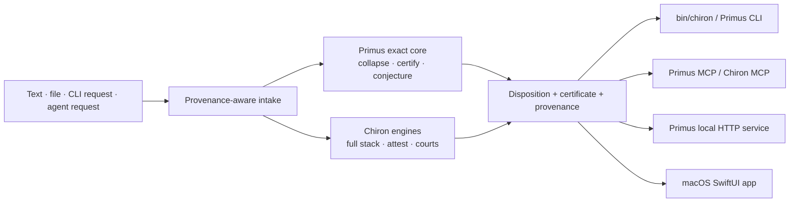

# Chiron reconstruction record

**Status:** Accepted evidence record, 2026-08-08. This records the system
that is present in this checkout; it is not a list of hoped-for features.

## ADR-001: preserve one deterministic vault; add interfaces at its boundary

**Status:** Accepted

### Context

The repository contains a tested Python verification vault (`Primus`,
`Chiron`, and JDICert), a generated offline fold, a local HTTP surface, MCP
servers, a CLI, and a macOS SwiftUI front end. These pieces are valuable only
when they execute the same underlying engines and preserve the same
`VERIFIED` / `REFUTED` / `REFUSED` contract.

The macOS app currently reaches that core through `Foundation.Process` and a
local Python runtime. That is a valid native macOS boundary. It cannot be
copied unchanged to iOS, where an app cannot ship or execute this external
Python vault through the same mechanism.

### Decision

Treat the existing Python vault as the canonical computational core. New
interfaces must invoke it or a deliberately versioned service boundary around
it; they must not reimplement verification logic or translate verdicts into a
new vocabulary.



### Options considered

| Option | Decision | Reason |
|---|---|---|
| Rewrite the core in Swift | Rejected | It would create a second stamping path before parity could be proven. |
| Add an iOS target that shells out to Python | Rejected | iOS sandboxing makes that architecture non-functional. |
| Keep the Python core and make interface boundaries explicit | Accepted | Preserves existing engines, gates, provenance, and the macOS product. |
| Expose the existing local HTTP surface publicly by default | Rejected | A remote service needs authentication and transport security; local-only is the safe default. |

### Consequences

- macOS remains a first-class product surface today.
- iOS is explicitly **unimplemented**, not a paper target: it requires an
  authenticated service client or an audited portable engine before a target
  should be created.
- MCP, CLI, HTTP, and the app share the existing Python core rather than
  presenting competing interpretations of a result.
- Any Chiron source edit must still regenerate the monolith and manifest.

## Canonical sources and generated artifacts

| Concern | Source of truth | Generated or interface-only artifact |
|---|---|---|
| Exact invariant recovery | `Primus/src/primus/engine.py` | `Primus/invariant_engine.py` compatibility shim |
| Exact claim certification | `Primus/src/primus/certify.py` | Primus CLI, MCP, and HTTP responses |
| Chiron engines | `Chiron/*.py` | `Chiron Monolith/chiron_monolith.py` (regenerate; never hand-edit) |
| Court-grade decision layer | `JDICert/cert_engine.py`, `JDICert/primer.py` | Chiron bridges and certificates |
| Native macOS surface | `App/Sources/` | `App/build/Chiron.app` (local build artifact) |
| Module catalog | `Chiron/*.py` | `Chiron/manifest.json`, `docs/ENCYCLOPEDIA.md` |

`Chiron/chiron_memory.json` is local, ignored runtime state and must not be
committed. It can contain third-party source material; the tracked
`chiron_memory_clean.json` files are empty seeds, not a substitute corpus.

## Implemented surface matrix

| Surface | Actual status | Evidence / boundary |
|---|---|---|
| Primus deterministic core | implemented-and-tested | Exact arithmetic, held-out verification, refusal; packaged through `Primus/pyproject.toml`. |
| Chiron full stack | implemented-and-tested | `Chiron/full_stack.py` runs every applicable layer and marks non-applicable stages `SKIPPED`. It accepts stdin for bounded file flows. |
| Chiron monolith | generated, tested artifact | Lossless fold of `Chiron/*.py`; regenerate after source changes. |
| CLI | implemented-and-tested | `bin/chiron` delegates to the canonical engines; Primus also ships package entry points. |
| MCP | implemented-and-tested locally | Primus exposes `certify`, `collapse`, `conjecture`; Chiron exposes `attest`, `analyze`, `certify`, `catalog`, `call` over stdio. |
| Local service | implemented-and-tested locally | `primus.engine_server` is an authenticated-when-configured HTTP boundary. It is not a public deployment. |
| macOS app | implemented-and-tested locally | SwiftPM SwiftUI app delegates to the vault; it has no independent verification implementation. |
| iOS app | unimplemented | The current `Foundation.Process` execution boundary is macOS-only. |
| Cloud language providers | partial / configuration-gated | `Chiron/llm_providers.py` contains provider adapters. No configured key or live provider was treated as evidence in this record. |
| Apple Foundation Models | unimplemented | No supported Foundation Models adapter was found in the current source. |
| Palantir Foundry / AIP | unimplemented | No authorized credentials, endpoint, ontology, or client integration was found in this vault. |

## Verified integration and safety work in this reconstruction

- The macOS Full Stack path now sends content over stdin rather than a single
  command-line argument, avoiding `ARG_MAX` failures for accepted files.
- Picker, drag/drop, and Attest multi-file candidate flows preserve the 2 MB
  truncation state and show it at the point of analysis. File-size metadata is
  checked, with a one-byte-over-bound read as the fallback proof of
  truncation.
- `Chiron/full_stack.py --stdin` is a canonical CLI path and rejects ambiguous
  simultaneous argv and stdin text.
- A real Chiron MCP transport test drives initialization, tool discovery,
  `analyze`, `certify`, `attest`, `catalog`, `call`, unknown-tool handling, and
  ping through a subprocess—not only in-process helpers.
- Codex CLI successfully invoked `chiron/analyze` and received
  `chiron.full_stack/1`. In this environment, that local MCP subprocess did
  not start under Codex's read-only sandbox; it did under the local execution
  sandbox. Treat the server as a trusted local tool, not an ambient sandbox
  capability.
- Claude Code health-checked both servers, but its model-driven invocation was
  not attempted because the installed CLI reported that it is not logged in.
- Xcode 27.0's SwiftPM scheme ran the 13-test macOS suite end to end after
  the test harness anchored the checkout and Python selection avoided Xcode's
  dependency-light bundled runtime.

## Security and release posture

- The primary vault's ignore rules cover provider keys and local environment
  files. A filename/pattern scan found no committed high-confidence private
  keys or provider-token signatures; that is not a claim about history or
  external account configuration.
- MCP is stdio-only and local. Its `call` tool is a trusted-local dispatch
  surface; it must not be exposed as a remote unauthenticated API.
- The Primus HTTP deployment notes describe request limits and optional bearer
  authentication. No production endpoint is configured by this record.
- `App/build/Chiron.app` is a local, ad-hoc-signed artifact. There is no
  distribution signing identity, notarization result, App Store entitlement
  review, privacy manifest, or release archive evidence here.

## Validation commands

Run the current gates from the vault root:

```bash
python3 Chiron/chiron.py selftest
python3 Chiron/stress_test.py selftest
python3 Chiron/tests/test_chiron.py
python3 Chiron/tests/test_mcp_server.py
python3 Chiron/mcp_server.py selftest
python3 bin/chiron test --full
cd App && swift test --scratch-path /tmp/chiron-build
cd App && xcodebuild -scheme ChironApp-Package -destination 'platform=macOS' \
  -derivedDataPath /tmp/chiron-xcode test
```

After a Chiron module change, regenerate the fold and the manifest before
claiming parity:

```bash
cd "Chiron Monolith" && python3 build_monolith.py && python3 chiron_monolith.py --smoke
cd .. && python3 Chiron/build_manifest.py --run && python3 Chiron/build_encyclopedia.py
```

## Next autonomous action

Design and test the smallest authenticated service contract that an iOS client
could use **without** copying the stamping path into Swift. The first change
should be a versioned, local-only request/response schema and mocked Swift
client tests; do not add an iOS target until that boundary, its file-consent
model, and its authentication behavior are explicit.
